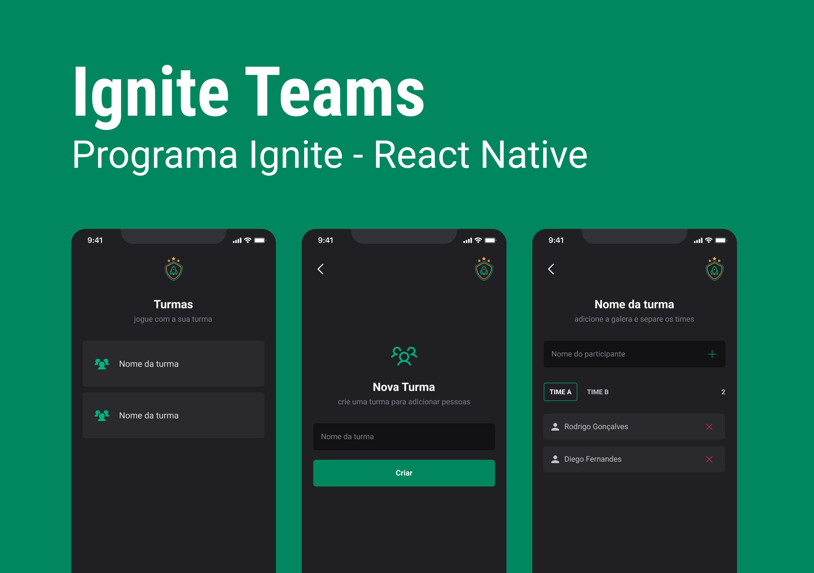

# Ignite Teams

## Sobre o projeto

Aplicativo desenvolvido em aula para se familiarizar com react-native. Este app foi criado para a organização de times. Podendo criar diversas turmas, e em cada turma é acresentado participantes, dividindo-os entre os grupos A e B.

## O que foi aprendido neste projeto?

1. Mapeamento das rotas no babel.config.js e tsconfig.json
2. Estruturação de pastas, especialmente do storage
3. Armazenar dados localmente com AsyncStorage
4. Funções assíncronas e uso do try, catch
5. Classe de erro personalizada, tratar e gerar exceções, além de distinguir quando essas exceções eram as nossas
6. Manipular referência de um componente (podendo eliminar o focus)
7. Usar botão do teclado como atalho para botão do app
8. Indicador de loading
9. Utilização de fontes personalizadas e garantir como primeiro carregamento
10. Navegação e boas práticas
